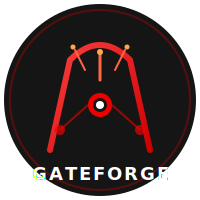

<p align="center">
  
</p>

# GateForge - 3scale to Connectivity Link Migration

[](https://github.com/maximilianoPizarro/gateforge/actions/workflows/build-push-quay.yml)
[](https://artifacthub.io/packages/search?repo=gateforge)
[](https://quay.io/repository/maximilianopizarro/gateforge-backend)
[](https://quay.io/repository/maximilianopizarro/gateforge-frontend)
[](https://quay.io/repository/maximilianopizarro/gateforge-devhub-frontend-plugin)
[](https://docs.openshift.com/)
[](https://maximilianopizarro.github.io/gateforge/)

AI-powered migration platform for transitioning from **Red Hat 3scale API Management** to **Red Hat Connectivity Link** (Kuadrant) on OpenShift. Built with **Quarkus** (backend), **Angular** (frontend), **PostgreSQL** (persistence), and **LangChain4j** (AI).

> **v0.1.7** -- Multi-source 3scale, multi-cluster deployment, hub-spoke architecture with PostgreSQL persistence.

### About this project

> **GateForge** is an independent open-source project licensed under Apache 2.0. It is **not** an official Red Hat product. It integrates with Red Hat 3scale, Red Hat Connectivity Link, and Red Hat Developer Hub but is maintained independently. No commercial support or SLAs are offered at this time.

---

## Architecture Overview

| Layer | Technology | Description |
|-------|-----------|-------------|
| **Frontend** | Angular 18 | SPA served by Nginx (UBI9) |
| **Backend** | Quarkus 3.x, Java 17 | REST API, AI agent, MCP servers, kuadrantctl integration |
| **Persistence** | PostgreSQL 15 | Migration plans, audit trail, federated logs |
| **DB Migrations** | Flyway | Versioned schema evolution (`db/migration/V*.sql`) |
| **AI** | LangChain4j, deepseek-r1-distill-qwen-14b | Migration analysis, resource generation, chat assistant |
| **MCP Servers** | 3scale, Connectivity Link, Kubernetes | Tool calling for AI agent via Model Context Protocol |
| **Migration** | Fabric8 K8s Client | Generate HTTPRoute, AuthPolicy, RateLimitPolicy from 3scale configs |
| **Developer Hub** | GateForge Plugin (backend + frontend) | Observability tabs, Policy Topology, Component editing, catalog enrichment |
| **Packaging** | Helm Chart, Podman Compose | OpenShift deployment + local development |

**Containers:** Backend uses `registry.access.redhat.com/ubi9/openjdk-17`. Frontend uses `registry.access.redhat.com/ubi9/nginx-124`. PostgreSQL uses `registry.redhat.io/rhel9/postgresql-15`.

---

## Key Features (v0.1.7)

### Phase 1: Multiple 3scale Sources
- Connect to **N 3scale Admin API endpoints** simultaneously
- Products tagged by source cluster (`sourceCluster` field)
- REST API for source management (`/api/threescale/sources`)
- Environment variable `THREESCALE_SOURCES` for JSON array configuration

### Phase 2: Multi-Cluster Deployment
- **Target cluster selector** in Migration Wizard
- Dynamic Fabric8 `KubernetesClient` per target cluster
- **ArgoCD cluster secret auto-discovery** from `openshift-gitops` namespace
- Per-cluster RBAC validation via `SelfSubjectAccessReview`
- REST API for cluster management (`/api/cluster/targets`)

### Phase 4: AI-Powered Analysis
- **Context injection** (not RAG) — live cluster state is injected into each LLM prompt
- **FAQ cache** with Data Grid (24h TTL) — 10 pre-defined prompts warmed at startup
- **kuadrantctl integration** — 5 CLI commands for resource generation and topology
- **Verification** — AI reviews generated resources post-generation for correctness

### Phase 5: Developer Hub Integration
- **Software Template Registration**: Components registered via standard RHDH Software Templates (`gateforge-register-component` / `gateforge-unregister-component`)
- **Observability Tab**: Prometheus/Thanos metrics embedded in RHDH entity pages (request rate, error rate, latency percentiles)
- **Policy Topology Tab**: Kuadrant policy DAG visualization (Gateway → HTTPRoute → policies → APIProduct → APIKey)
- **Component Editor**: Inline editing for platformadmin (no repo required) — annotations, tags, description
- **Pre-registration Editing**: Edit Component definition before catalog registration
- **Catalog Enrichment**: `GateForgeKuadrantProcessor` enriches 3scale API entities with `kuadrant.io/*` annotations

### Phase 3: Hub-Spoke Architecture
- **PostgreSQL persistence** for migration plans and audit entries (replaces in-memory storage)
- **Flyway migrations** for versioned schema evolution (`src/main/resources/db/migration/`)
- **Federated audit log** with cluster/action filtering (`/api/hub/audit`)
- **Hub overview API** with aggregated stats (`/api/hub/overview`)
- **Topology API** showing all clusters and sources (`/api/hub/topology`)

---

## Prerequisites

* **OpenShift 4.21** with cluster-admin or least-privilege RBAC
* **3scale Operator** installed (for CRD discovery)
* **Kuadrant Operator** / Connectivity Link installed
* **Podman** (and optionally **podman-compose**) for local development
* **Java 17** + **Maven 3.9+** for backend development
* **Node.js 20** for frontend development
* **Helm 3** for deployment

---

## Running the Solution

### Local Development

**Backend:**

```bash
cd backend
mvn quarkus:dev
```

**Frontend:**

```bash
cd frontend
npm install
npm start
```

Open **http://localhost:4200**. The Angular dev server proxies `/api` to `http://localhost:8080`.

### Containers (Podman Compose)

```bash
podman-compose up -d --build
```

* **Frontend:** http://localhost:4200
* **Backend API:** http://localhost:8080/api
* **Health:** http://localhost:8080/q/health
* **PostgreSQL:** localhost:5432 (user: `gateforge`, db: `gateforge`)

### Helm Chart (OpenShift)

```bash
helm repo add gateforge https://maximilianopizarro.github.io/gateforge/
helm install gateforge gateforge/gateforge \
  --set ai.apiKey=YOUR_KEY \
  --set threescale.adminApi.url=https://3scale-admin.apps.example.com \
  --set threescale.adminApi.accessToken=YOUR_TOKEN \
  --set clusterDomain=apps.cluster.example.com
```

### Multi-Source Configuration

Pass additional 3scale sources as a JSON array:

```bash
helm install gateforge gateforge/gateforge \
  --set threescale.sources='[{"id":"prod","label":"Production 3scale","adminUrl":"https://3scale-admin.prod.example.com","accessToken":"TOKEN","enabled":true}]'
```

### Multi-Cluster Configuration

Add target clusters or enable ArgoCD discovery:

```bash
helm install gateforge gateforge/gateforge \
  --set argocd.clusterDiscovery=true \
  --set targetClusters='[{"id":"staging","label":"Staging Cluster","apiServerUrl":"https://api.staging.example.com:6443","token":"TOKEN","authType":"token","verifySsl":false,"enabled":true}]'
```

---

## API Endpoints

### Core APIs

| Endpoint | Method | Description |
|----------|--------|-------------|
| /api/cluster/projects | GET | List all cluster projects |
| /api/threescale/products | GET | List 3scale Products (all sources, CRD + Admin API) |
| /api/threescale/backends | GET | List 3scale Backends (all sources) |
| /api/threescale/status | GET | Admin API connectivity status |
| /api/migration/analyze | POST | Analyze and plan migration (with target cluster) |
| /api/migration/plans | GET | List migration plans |
| /api/migration/plans/{id}/apply | POST | Apply plan to target cluster |
| /api/migration/plans/{id}/revert | POST | Revert plan from target cluster |
| /api/migration/revert-bulk | POST | Bulk revert to 3scale |
| /api/audit/reports | GET | View audit log |
| /api/chat | POST | AI migration assistant |

### Multi-Source APIs (Phase 1)

| Endpoint | Method | Description |
|----------|--------|-------------|
| /api/threescale/sources | GET | List all 3scale sources |
| /api/threescale/sources | POST | Add a new 3scale source |
| /api/threescale/sources/{id} | DELETE | Remove a 3scale source |
| /api/threescale/sources/{id}/status | GET | Check source connectivity |

### Multi-Cluster APIs (Phase 2)

| Endpoint | Method | Description |
|----------|--------|-------------|
| /api/cluster/targets | GET | List target clusters |
| /api/cluster/targets | POST | Add a target cluster |
| /api/cluster/targets/{id} | DELETE | Remove a target cluster |
| /api/cluster/targets/{id}/validate | GET | Validate RBAC access on target |

### Developer Hub Integration APIs (Phase 5)

| Endpoint | Method | Description |
|----------|--------|-------------|
| /api/migration/plans/{id}/catalog-info/{product} | GET | Serve generated catalog-info.yaml for catalog:register |
| /api/migration/plans/{id}/confirm-registration | POST | Confirm Component registration (with optional edits) |

### Hub-Spoke APIs (Phase 3)

| Endpoint | Method | Description |
|----------|--------|-------------|
| /api/hub/overview | GET | Aggregated hub stats (plans, clusters, audit) |
| /api/hub/audit | GET | Federated audit log (filter by cluster, action) |
| /api/hub/plans | GET | Federated plans (filter by cluster, status) |
| /api/hub/topology | GET | Cluster + source topology graph |

---

## Helm Chart Values

| Value | Default | Description |
|-------|---------|-------------|
| `backend.image.tag` | v0.1.7 | Backend image tag |
| `frontend.image.tag` | v0.1.7 | Frontend image tag |
| `ai.enabled` | true | Enable AI features |
| `ai.endpoint` | litellm-prod... | LLM endpoint URL |
| `ai.model` | deepseek-r1-distill-qwen-14b | AI model name |
| `ai.apiKey` | "" | LLM API key |
| `threescale.adminApi.url` | "" | 3scale Admin Portal URL |
| `threescale.adminApi.accessToken` | "" | 3scale access token |
| `threescale.sources` | "" | JSON array of additional 3scale sources |
| `targetClusters` | "" | JSON array of target clusters |
| `argocd.clusterDiscovery` | false | Auto-discover clusters from ArgoCD secrets |
| `postgresql.enabled` | true | Deploy PostgreSQL for persistence |
| `postgresql.username` | gateforge | Database username |
| `postgresql.password` | gateforge | Database password |
| `connectivityLink.gatewayStrategy` | shared | shared / dual / dedicated |
| `connectivityLink.gatewayClassName` | istio | Gateway class |
| `rbac.clusterAdmin` | false | Use cluster-admin (dev only) vs least-privilege |
| `developerHub.scaffolderUrl` | "" | RHDH Scaffolder API URL for Component registration |
| `developerHub.scaffolderToken` | "" | Bearer token for Scaffolder API authentication |
| `route.enabled` | true | Create OpenShift Route |

---

## Official Documentation

* [Red Hat Connectivity Link](https://docs.redhat.com/en/documentation/red_hat_connectivity_link)
* [Kuadrant Docs](https://docs.kuadrant.io/)
* [kuadrantctl](https://github.com/Kuadrant/kuadrantctl)
* [3scale API Management](https://docs.redhat.com/en/documentation/red_hat_3scale_api_management)
* [3scale Operator](https://github.com/3scale/3scale-operator)
* [Gateway API](https://gateway-api.sigs.k8s.io/)
* [Quarkus LangChain4j + MCP](https://quarkus.io/blog/quarkus-langchain4j-mcp/)
* [Migration Guide (ONLU)](https://onlu.ch/en/migration-path-from-red-hat-3scale-api-management-to-red-hat-connectivity-link/)

---

## License

[](https://opensource.org/licenses/Apache-2.0)

This software is licensed under the [Apache License 2.0](LICENSE).
